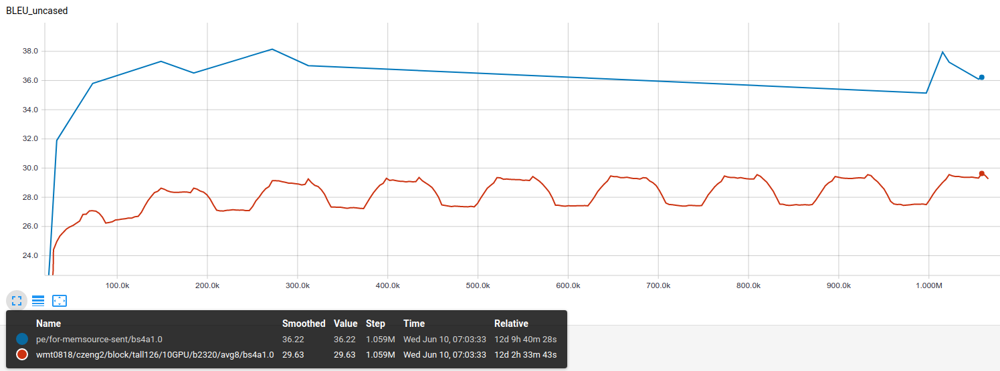

- sent = sentence-level CUBBITT 2020
- doc  = document-level CUBBITT 2020

- The number in the filename is the number of training steps.
- The batch size was 23.200 tokens for sent model and 18.000 tokens for the doc model.
- The subword vocabulary size was 32k.
- The training speed was about 3466 steps per hour (on 10 GPUs).

| MODEL              | BLEU pe  | BLEU pe lc intl | BLEU wmt0818 | Name | note |
|-|-|-|-|-|-|
| sent-25385.txt     | 23.29 | 24.77 | 19.07 | M01 | the first checkpoint available with avg8 (after 7 hours of training)|
| sent-32966.txt     | 31.58 | 32.97 | 24.42 | M02 | |
| sent-72836.txt     | 33.05 | 34.74 | 26.25 | M03 | until here the dev-set BLEU curves grows monotonically (despite BlockBT training), the "second peak" ~ 6-7auth + 1-2synth checkpoints in avg8 |
| sent-148593.txt    | 34.96 | 36.78 | 27.87 | M04 | the nearest following "first peak" ~ 1-2 synth + 6-7 auth |
| sent-184873.txt    | 34.83 | 36.91 | 28.00 | M05 | the nearest following "second peak" ~ 6-7 auth + 1-2 synth |
| sent-271937.txt    | 35.25 | 37.27 | 28.38 | M06 | the nearest following "first peak" ~ 1-2 synth + 6-7 auth |
| sent-311870.txt    | 34.67 | 36.75 | 28.60 | M07 | the nearest following "second peak" ~ 6-7 auth + 1-2 synth |
| sent-997083.txt    | 32.69 | 34.69 | 26.64 | M08 | "end of valley" ~ 8 synth |
| sent-1015168.txt   | 34.44 | 36.44 | 28.14 | M09 | "before the first peak" ~ 5 auth + 3 synth |
| sent-1022401.txt   | 34.81 | 36.93 | 28.84 | M10 | "first peak" ~ 1-2 synth + 6-7 auth |
| sent-1054981.txt   | 35.55 | 37.59 | 28.72 | M11 | "before the second peak" ~ 8 auth|
| sent-1058593.txt   | 34.77 | 36.87 | 28.95 | M12 | submitted to WMT2020 as CUNI-Transformer; "second peak" ~ 6-7 auth + 1-2 synth |
| doc-698515.sgm	   | 35.38 | 37.46 | 28.46 | M13 | submitted to WMT2020 as CUNI-DocTransformer; "second peak" ~ 5 auth + 3 synth |
| Google | 37.56 | 40.10 | 26.06 | C1 |  |
| Microsoft | 33.06 | 34.20 | 26.30 | C2 |  |

BLEU was computed with `sacrebleu -w 2`, "BLEU lc intl" was computed with `sacrebleu -w 2 -lc -tok intl`.

BLEU-pe is BLEU computed on [our PE set](https://github.com/ELITR/nmt-pe-effects-2020/blob/master/docs/translations/sgm/REFERENCE.sgm).
BLEU-wmt0818 is BLEU computed on the dev set: WMT08, WMT09...WMT18 concatenated, but only orig-en and orig-cs docs.
The checkpoints were chosen according to their dev-set BLEU.

The graph below shows "BLEU lc intl", but the "PE" test set contained extra lines with "DOC=monsoon", so the BLEU scores are bit different than above - I am sorry for this confusion.

